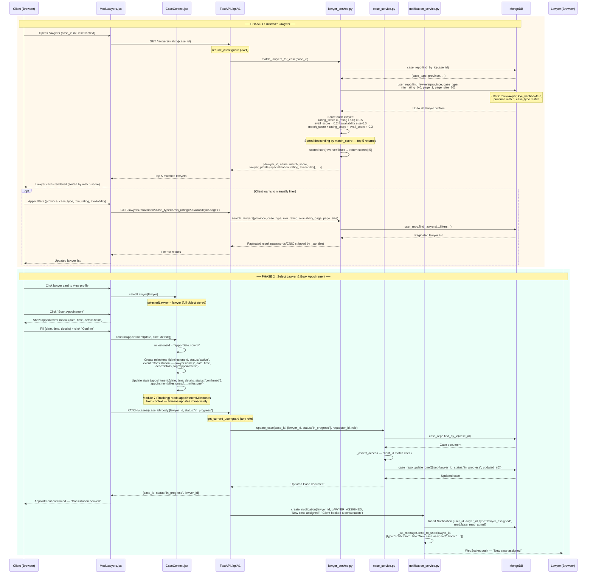
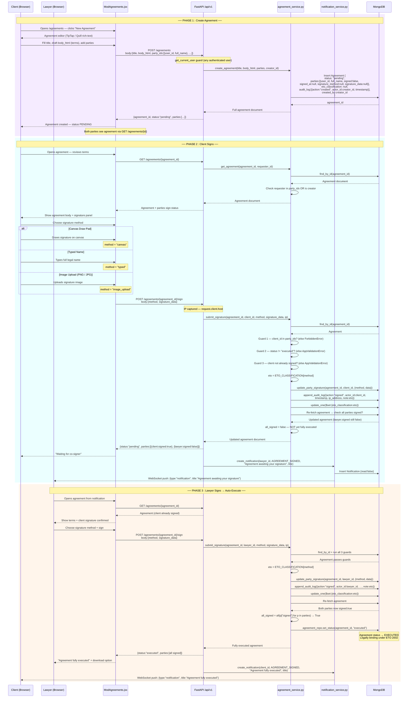
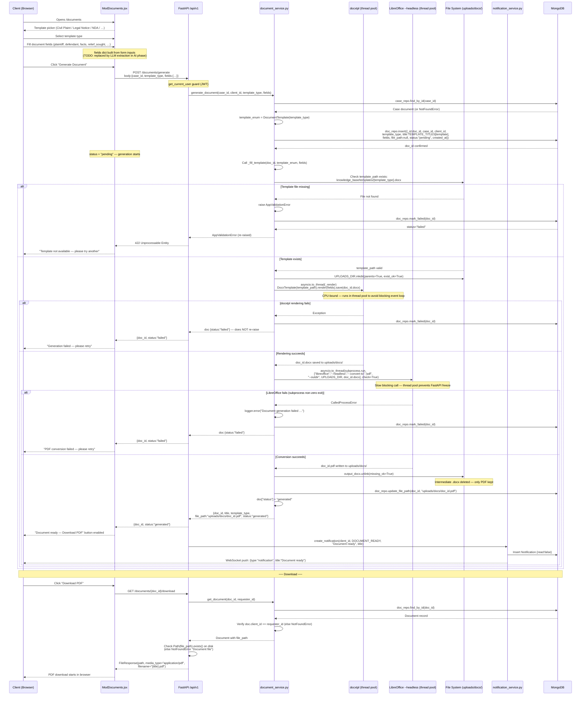

# Attorney.AI — Sequence Diagrams (4)
> All endpoints, field names, validation rules, response shapes, and logic are sourced directly from the backend source code.

---

## SD-1 — Legal Query Intake & AI Case Structuring (M2 + M3)

**Modules:** M2 (Legal Intake) + M3 (AI Legal Guidance)

**Key source files:**
- `backend/app/services/intake_service.py`
- `backend/app/api/v1/routes/intake.py`
- `backend/app/services/case_service.py`
- `backend/app/websockets/chat_socket.py`
- `frontend/src/components/client/ModIntake.jsx`
- `frontend/src/components/client/ModChatbot.jsx`
- `frontend/src/components/shared/CaseContext.jsx`

```mermaid
sequenceDiagram
    participant U  as Client (Browser)
    participant FE as ModIntake.jsx
    participant CTX as CaseContext.jsx
    participant API as FastAPI /api/v1
    participant IS  as intake_service.py
    participant CS  as case_service.py
    participant DB  as MongoDB
    participant WS  as WebSocket /ws/chat/{session_id}
    participant CH  as chat_socket.py
    participant CR  as chat_repo (MongoDB)

    rect rgb(235, 245, 255)
        Note over U,DB: ── PHASE 1 : M2  Legal Intake (5 Steps) ──

        U->>FE: Opens /intake
        FE->>API: POST /intake/start
        Note over API: require_client guard (JWT)
        API->>IS: start_intake(client_id)
        IS->>DB: Insert Intake {current_step:1, completed:false,<br/>step1-5: null, ai_structured_case.summary:"pending"}
        DB-->>IS: intake saved
        IS-->>API: {session_token, message:"Intake session started"}
        API-->>FE: {session_token}
        Note over FE: Token stored for all PATCH calls

        Note over U,FE: Step 1 — Role + Province
        U->>FE: Select role (Plaintiff | Defendant) + select province
        FE->>API: PATCH /intake/{token}/step/1  body:{data:{province}}
        API->>IS: save_step(token, 1, data, client_id)
        IS->>IS: _validate_step(1) — required:[province]
        IS->>DB: Update Intake.step1 = {role, province}
        DB-->>IS: OK
        IS-->>API: {session_token, current_step:1, completed:false, case_id:null}
        API-->>FE: Step 1 saved

        Note over U,FE: Step 2 — Case Type + Urgency
        U->>FE: Choose case_type (CIVIL/CRIMINAL/CONSTITUTIONAL/FAMILY) + urgency
        FE->>API: PATCH /intake/{token}/step/2  body:{data:{case_type, urgency}}
        API->>IS: save_step(token, 2, data, client_id)
        IS->>IS: _validate_step(2) — required:[case_type, urgency]
        IS->>DB: Update Intake.step2
        IS-->>API: {current_step:2, completed:false}
        API-->>FE: Step 2 saved

        Note over U,FE: Step 3 — Incident Description (AI Follow-up Questions)
        U->>FE: Describe incident (text or voice) — answer AI follow-up questions
        FE->>API: PATCH /intake/{token}/step/3  body:{data:{incident_description, incident_date, incident_location}}
        API->>IS: save_step(token, 3, data, client_id)
        IS->>IS: _validate_step(3) — required:[incident_description]
        IS->>DB: Update Intake.step3
        IS-->>API: {current_step:3, completed:false}
        API-->>FE: Step 3 saved

        Note over U,FE: Step 4 — Evidence Info (optional fields)
        U->>FE: Fill evidence details (optional: has_evidence, opposing_party)
        FE->>API: PATCH /intake/{token}/step/4  body:{data:{has_evidence, evidence_description, opposing_party}}
        API->>IS: save_step(token, 4, data, client_id)
        IS->>IS: _validate_step(4) — required:[] (no required fields)
        IS->>DB: Update Intake.step4
        IS-->>API: {current_step:4, completed:false}
        API-->>FE: Step 4 saved

        Note over U,FE: Step 5 — Desired Outcome + Categorization
        U->>FE: State desired outcome + select case category
        FE->>API: PATCH /intake/{token}/step/5  body:{data:{desired_outcome, additional_notes}}
        API->>IS: save_step(token, 5, data, client_id)
        IS->>IS: _validate_step(5) — required:[desired_outcome]
        IS->>DB: Update Intake.step5
        IS-->>API: {current_step:5, completed:false}
        API-->>FE: Step 5 saved — all steps complete

        Note over U,FE: Submit — Convert Intake to Case
        U->>FE: Click "Submit Case"
        FE->>API: POST /intake/{token}/convert
        API->>IS: convert_to_case(token, client_id)
        IS->>DB: Fetch intake by token
        DB-->>IS: Full intake document
        IS->>IS: Validate: all step1-5 present<br/>(else AppValidationError "Steps not completed:[n]")
        IS->>CS: create_case(client_id, {case_type:step2.case_type, province:step1.province,<br/>title:step3.incident_description[:80], description:step3.incident_description, intake_id})
        CS->>DB: Insert Case {case_number:"ATT-{year}-{hex}", status:"open",<br/>lawyer_id:null, milestones:[], hearing_dates:[], case_embedding:null}
        DB-->>CS: case_id
        CS-->>IS: Case document
        Note over IS: TODO: trigger ai_structured_case async processing
        IS->>DB: Mark Intake {completed:true, case_id}
        IS-->>API: {session_token, completed:true, case_id}
        API-->>FE: {case_id}
        FE->>CTX: completeIntake({role, caseType, caseSubtype, description, evidenceDocs})
        Note over CTX: intakeDone=true, caseRef set
        FE-->>U: Redirect to /chat
    end

    rect rgb(235, 255, 240)
        Note over U,CR: ── PHASE 2 : M3  AI Legal Guidance (Chat) ──

        U->>FE: Opens /chat (case context loaded from CaseContext)
        Note over FE: ModChatbot mounts — session_id generated
        FE->>WS: WebSocket connect: ws://…/ws/chat/{session_id}?token=JWT
        WS->>CH: Handshake — decode_token(token)
        alt Token invalid
            CH-->>FE: close(code=4001)
        else Token valid
            CH->>CR: find_by_session(session_id)
            alt Session does not exist
                CR-->>CH: null
                CH->>CR: Insert ChatSession {session_id, client_id, case_id:null,<br/>messages:[], langgraph_checkpoint:null}
            end
            CH-->>FE: Connection accepted
            FE-->>U: Chat ready — greeting shown (time-based: Morning/Afternoon/Evening)

            U->>FE: Type query (EN or UR) + click Send
            Note over FE: typing=true; msg added to msgs[] {role:"user", text, time}
            FE->>WS: send({content, case_id, case_type, province})

            WS->>CH: receive_json(data)
            CH->>CR: append_message(session_id, {role:"user", content,<br/>citations:[], confidence:null, created_at})
            CH->>CR: update_session_meta(session_id, {case_id, case_type, province})

            Note over CH: TODO: invoke LangGraph supervisor + stream tokens
            Note over CH: Currently returns stub response

            CH->>WS: send_json({type:"final", content:"AI legal assistant is not yet connected.<br/>Your query has been recorded.", citations:[], confidence:0.0})
            WS-->>FE: Final response message
            Note over FE: typing=false; msg added {role:"ai", text, refs:citations}
            FE-->>U: AI response displayed

            CH->>CR: append_message(session_id, {role:"assistant", content,<br/>citations:[], confidence:0.0, created_at})
        end
    end
```

---

## SD-2 — Lawyer Discovery & Appointment Booking (M4)

**Module:** M4 (Lawyer Discovery)

**Key source files:**
- `backend/app/services/lawyer_service.py`
- `backend/app/api/v1/routes/lawyers.py`
- `backend/app/services/case_service.py`
- `backend/app/services/notification_service.py`
- `frontend/src/components/shared/CaseContext.jsx`

**Note on matching algorithm (current implementation):**
`match_score = (rating / 5.0) × 0.5  +  (0.2 if availability else 0)  +  0.3`
The `0.3` is a static placeholder — `TODO: replace with cosine_similarity(case_embedding, lawyer_embedding) × 0.5` once AI phase is integrated.

**Note on appointment booking:** No dedicated `/appointments` endpoint exists. Appointment confirmation is handled via `CaseContext.confirmAppointment()` in frontend state. Case assignment is persisted via `PATCH /cases/{case_id}`.



---

## SD-3 — Digital Agreement & E-Signing Workflow (M5)

**Module:** M5 (Digital Agreements & E-Signing)

**Key source files:**
- `backend/app/services/agreement_service.py`
- `backend/app/api/v1/routes/agreements.py`
- `backend/app/services/notification_service.py`
- `backend/app/core/constants.py`  (AgreementStatus, SignatureMethod)

**ETO 2002 classifications (from `ETO_CLASSIFICATION` dict in service):**
- `CANVAS` → `"Advanced Electronic Signature (ETO 2002 S.2(d)(i))"`
- `TYPED` → `"Basic Electronic Signature (ETO 2002)"`
- `IMAGE_UPLOAD` → `"Basic Electronic Signature (ETO 2002)"`

**Guards enforced by `submit_signature()`:**
1. User must be listed in `agreement.parties`
2. `agreement.status` must **not** be `EXECUTED`
3. That specific party must not have already signed



---

## SD-4 — Document Automation & AI Drafting (M6)

**Module:** M6 (Document Automation & Drafting)

**Key source files:**
- `backend/app/services/document_service.py`
- `backend/app/api/v1/routes/documents.py`
- `backend/app/services/notification_service.py`

**Template files location:** `knowledge_base/templates/{template_type}.docx`
**Generated files location:** `backend/app/uploads/docs/{doc_id}.pdf`

**Available templates (from `TEMPLATE_TITLES` dict):**
| `template_type` value | Title |
|---|---|
| `plaint_civil` | Civil Plaint |
| `written_statement` | Written Statement |
| `legal_notice` | Legal Notice |
| `nda` | Non-Disclosure Agreement |
| `rental_agreement` | Rental Agreement |

**Important — `fields` parameter:** Client currently provides the `fields` dict manually in the request body. The line `# TODO: AI — replace fields dict with LLM extraction from case data` is present in `document_service.py` — LLM auto-extraction is a planned AI-phase feature.

**Error handling (two distinct paths):**
- `AppValidationError` (e.g. template file missing) → `mark_failed()` + **re-raises** → 422 response to client
- Any other `Exception` (e.g. LibreOffice crash) → `mark_failed()` + **logged**, does **not** re-raise → returns doc with `status:"failed"`


