# Attorney.AI — Sequence & State Transition Diagrams
> Grounded in actual backend models, services, routes, and frontend components.

**Total: 10 Sequence Diagrams + 6 State Transition Diagrams = 16 diagrams**

> Excluded as trivial (per requirement): Login, Logout, View/Edit Profile, Register

---

## Quick Reference

| # | Type | Diagram Name | Source File(s) |
|---|---|---|---|
| SD-1 | Sequence | AI Legal Query (RAG Chatbot) | `websockets/chat_socket.py`, `ModChatbot.jsx` |
| SD-2 | Sequence | Legal Intake & Case Structuring | `services/intake_service.py`, `routes/intake.py`, `ModIntake.jsx` |
| SD-3 | Sequence | Document Generation Pipeline | `services/document_service.py`, `routes/documents.py` |
| SD-4 | Sequence | Lawyer Discovery & Matching | `services/lawyer_service.py`, `routes/lawyers.py` |
| SD-5 | Sequence | Digital Agreement & E-Signature | `services/agreement_service.py`, `routes/agreements.py` |
| SD-6 | Sequence | Admin KYC Verification | `services/admin_service.py`, `routes/admin.py` |
| STD-1 | State | Case Lifecycle | `models/case.py`, `core/constants.py` |
| STD-2 | State | Intake Step Progression | `models/intake.py`, `ModIntake.jsx`, `CaseContext.jsx` |
| STD-3 | State | Agreement Lifecycle | `models/agreement.py`, `services/agreement_service.py` |
| STD-4 | State | Document Generation Lifecycle | `models/document.py`, `services/document_service.py` |
| STD-5 | State | Lawyer Account (KYC) Lifecycle | `models/user.py`, `services/admin_service.py` |
| STD-6 | State | AI Chat Session Lifecycle | `websockets/chat_socket.py`, `ModChatbot.jsx` |

---

# SEQUENCE DIAGRAMS

---

## SD-1: AI Legal Query (RAG Chatbot)

**Non-trivial because:** 12-node LangGraph pipeline, WebSocket streaming, clarification re-entry loop, hallucination gating.

**Real WebSocket protocol** (`chat_socket.py`):
- Client sends: `{"content": str, "case_id"?: str, "case_type"?: str, "province"?: str}`
- Server streams tokens then sends: `{"type": "final", "content": str, "citations": [], "confidence": float}`
- Clarification path: `{"type": "clarification", "question": str}`

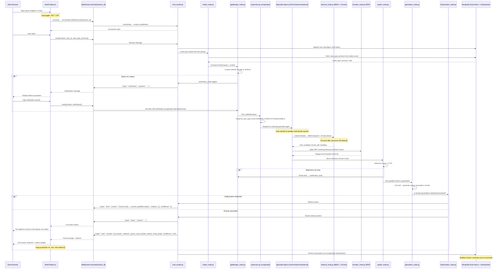
```mermaid
sequenceDiagram
    participant U as Client Browser
    participant FE as ModChatbot.jsx
    participant WS as WebSocket /ws/chat/{session_id}
    participant CS as chat_socket.py
    participant IN as intake_node.py
    participant GK as gatekeeper_node.py
    participant SV as supervisor.py (LangGraph)
    participant AG as Specialist Agent (civil/criminal/constitutional)
    participant RV as retrieval_node.py (BM25 + Chroma)
    participant RR as reranker_node.py (RRF)
    participant GR as grader_node.py
    participant GN as generation_node.py
    participant HN as hallucination_node.py
    participant DB as MongoDB (chat history + checkpointer)

    U->>FE: Types query (English or Urdu)
    Note over FE: lang toggle: "EN" | "UR"
    FE->>WS: connect() → ws://localhost:8000/ws/chat/{session_id}
    WS->>CS: Handshake — session established
    CS-->>FE: Connection open

    U->>FE: Click Send
    FE->>WS: send({content, case_id, case_type, province})
    WS->>CS: Receive message
    CS->>DB: Append user message to chat history
    CS->>IN: Load case context from M2 session

    IN->>DB: Fetch case_type, province from intake record
    DB-->>IN: {case_type, province, role}
    IN->>GK: Forward enriched query + context

    GK->>GK: Is query specific enough to retrieve?
    alt Query too vague
        GK->>CS: clarification_node triggers
        CS->>WS: {"type": "clarification", "question": "..."}
        WS-->>FE: Clarification message
        FE-->>U: Display follow-up question
        U->>FE: Type clarification answer
        FE->>WS: send({content: clarification})
        WS->>GK: Re-enter with clarification (LangGraph interrupt/resume)
    end

    GK->>SV: Pass validated query
    SV->>SV: Route by case_type (CIVIL/CRIMINAL/CONSTITUTIONAL/FAMILY)
    SV->>AG: Dispatch to matching specialist agent
    Note over AG: Uses Send() for parallel multi-domain queries

    AG->>RV: Hybrid retrieval — BM25 keyword + Chroma dense
    Note over RV: Province filter: {province OR federal}
    RV-->>AG: Raw candidate chunks with metadata

    AG->>RR: Apply RRF reranking (Reciprocal Rank Fusion)
    RR-->>AG: Merged and reranked chunk list

    AG->>GR: Score relevance of each chunk
    GR->>GR: relevance_score < 0.75?
    alt Relevance too low
        GR->>GK: Route back → clarification_node
    end

    GR->>GN: Pass graded chunks to generation
    GN->>GN: LLM call — generate answer grounded in chunks
    GN->>HN: Is answer grounded in retrieved documents?

    alt Hallucination detected
        HN->>CS: Refuse answer
        CS->>WS: {"type": "final", "content": "Cannot verify — consult a qualified lawyer", "citations": [], "confidence": 0}
    else Answer grounded
        HN->>CS: Stream token-by-token
        CS->>WS: {"type": "token", "content": "..."}
        WS-->>FE: Live token stream
        FE-->>U: Text appears word by word (typing: true state)
        CS->>WS: {"type": "final", "content": full_answer, "citations": [{court, case_number, section, chunk_text}], "confidence": 0.87}
        WS-->>FE: Final message + citations
        FE-->>U: Full answer rendered + citation badges
        Note over FE: msgs.push({role:"ai", text, refs:citations})
    end

    CS->>DB: Persist conversation turn (LangGraph checkpointer)
    Note over DB: Enables session continuity across reconnects
```

---

## SD-2: Legal Intake Submission & Case Structuring

**Non-trivial because:** Frontend has 5 distinct steps (role selection → AI follow-up → case summary → categorization) that differ from backend step schema. AI structures the intake into a case object. Session token auth used (not JWT).

**Real endpoints** (`routes/intake.py`):
- `POST /intake/start` → `{session_token}`
- `PATCH /intake/{token}/step/{n}` → `{current_step, completed}`
- `POST /intake/{token}/convert` → `{case_id, completed: true}`

**Real frontend steps** (`ModIntake.jsx`):
Step 1 = Role (Plaintiff/Defendant), Step 2 = Case Input (voice|text), Step 3 = AI Follow-up Questions, Step 4 = AI Case Summary, Step 5 = Categorization

```mermaid
sequenceDiagram
    participant U as Client
    participant FE as ModIntake.jsx
    participant CTX as CaseContext.jsx
    participant API as FastAPI /api/v1/intake
    participant SVC as intake_service.py
    participant CB as case_builder.py (AI)
    participant DB as MongoDB

    U->>FE: Opens /intake page
    FE->>API: POST /intake/start
    API->>SVC: start_intake(client_id)
    SVC->>DB: Insert Intake {current_step:1, completed:false, step1..5: null}
    DB-->>SVC: intake_id
    SVC-->>API: {session_token}
    API-->>FE: {session_token}
    Note over FE: Token stored — used for all subsequent PATCH calls

    rect rgb(240, 248, 255)
        Note over U,DB: Step 1 — Role Selection
        U->>FE: Select role (Plaintiff | Defendant)
        Note over FE: canGoToStep validation: role required
        FE->>API: PATCH /intake/{token}/step/1 {role, province}
        API->>SVC: save_step(token, 1, data)
        SVC->>SVC: Validate required fields: [province]
        SVC->>DB: Update Intake.step1 = {role, province}
        DB-->>SVC: OK
        SVC-->>API: {current_step:1, completed:false}
        API-->>FE: Step 1 saved
        FE->>FE: Advance to Step 2 (progress = 20%)
    end

    rect rgb(240, 255, 240)
        Note over U,DB: Step 2 — Case Input (voice | text)
        U->>FE: Describe case (text input OR voice recording)
        Note over FE: is_recording state toggle; autosave on change
        U->>FE: Upload evidence documents (optional)
        FE->>API: PATCH /intake/{token}/step/2 {case_type, urgency, input_type}
        API->>SVC: save_step(token, 2, data)
        SVC->>SVC: Validate required: [case_type, urgency]
        SVC->>DB: Update Intake.step2
        DB-->>SVC: OK
        API-->>FE: Step 2 saved
        FE->>FE: Advance to Step 3 (progress = 40%)
    end

    rect rgb(255, 248, 240)
        Note over U,DB: Step 3 — AI Follow-up Questions (6 questions, 2/3 required)
        FE-->>U: Display AI-generated follow-up questions
        U->>FE: Answer questions (Required/Optional indicators shown)
        FE->>API: PATCH /intake/{token}/step/3 {incident_description, incident_date, incident_location}
        API->>SVC: save_step(token, 3, data)
        SVC->>SVC: Validate required: [incident_description]
        SVC->>DB: Update Intake.step3
        API-->>FE: Step 3 saved
        FE->>FE: Advance to Step 4 (progress = 60%)
    end

    rect rgb(248, 240, 255)
        Note over U,DB: Step 4 — AI-Generated Case Summary (editable, confidence score shown)
        FE-->>U: Show AI case summary with confidence % (e.g., 87%)
        U->>FE: Edit summary if needed (has_evidence, evidence_description, opposing_party)
        FE->>API: PATCH /intake/{token}/step/4 {has_evidence, evidence_description, opposing_party}
        API->>SVC: save_step(token, 4, data)
        SVC->>DB: Update Intake.step4
        API-->>FE: Step 4 saved
        FE->>FE: Advance to Step 5 (progress = 80%)
    end

    rect rgb(255, 240, 240)
        Note over U,DB: Step 5 — Case Categorization
        U->>FE: Select case category + fill category-specific fields + desired outcome
        FE->>API: PATCH /intake/{token}/step/5 {desired_outcome, additional_notes}
        API->>SVC: save_step(token, 5, data)
        SVC->>SVC: Validate required: [desired_outcome]
        SVC->>DB: Update Intake.step5
        API-->>FE: Step 5 saved (progress = 100%)
    end

    U->>FE: Click "Submit Case"
    FE->>API: POST /intake/{token}/convert
    API->>SVC: convert_to_case(token)
    SVC->>SVC: Validate all 5 steps are filled
    SVC->>CB: Structure intake → Case object (AI extraction)
    CB->>CB: Extract case_type, province, ai_structured_case.summary
    CB->>DB: Insert Case {status: OPEN, case_type, province, intake_id, case_number: "ATT-{year}-{hex}"}
    DB-->>CB: case_id
    CB->>DB: Update Intake {completed: true, case_id}
    CB-->>SVC: case_id
    SVC-->>API: {case_id, completed: true}
    API-->>FE: {case_id}
    FE->>CTX: completeIntake({role, caseType, caseSubtype, description, evidenceDocs})
    Note over CTX: intakeDone = true, caseRef = "ATT-{year}-{hex}"
    FE-->>U: Redirect to /chat (case context pre-loaded)
```

---

## SD-3: AI Document Generation Pipeline

**Non-trivial because:** LLM extracts structured fields from case → docxtpl fills .docx template → LibreOffice headless converts to PDF → stored for download. Failure path transitions document back to `failed` status.

**Real endpoints** (`routes/documents.py`):
- `POST /documents/generate` → `{doc_id, file_url}` (status: pending → generated | failed)
- `GET /documents/{doc_id}/download` → binary PDF (requires `file_path` to exist)

**Real templates** (`constants.py`): `PLAINT_CIVIL`, `WRITTEN_STATEMENT`, `LEGAL_NOTICE`, `NDA`, `RENTAL_AGREEMENT`

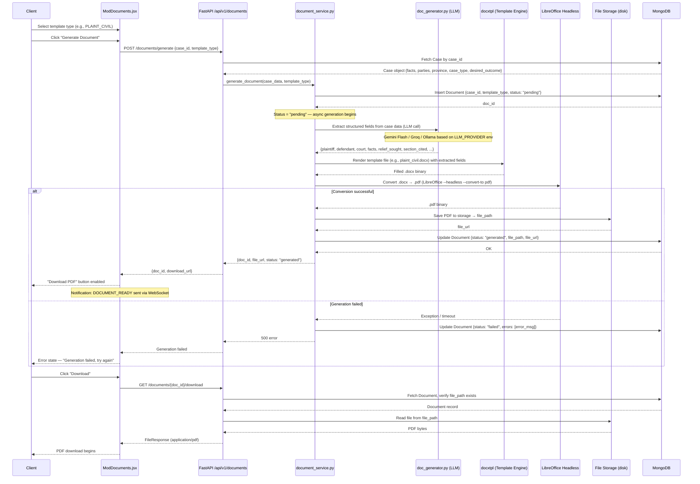
```mermaid
sequenceDiagram
    participant U as Client
    participant FE as ModDocuments.jsx
    participant API as FastAPI /api/v1/documents
    participant SVC as document_service.py
    participant AI as doc_generator.py (LLM)
    participant TPL as docxtpl (Template Engine)
    participant LO as LibreOffice Headless
    participant FS as File Storage (disk)
    participant DB as MongoDB

    U->>FE: Select template type (e.g., PLAINT_CIVIL)
    U->>FE: Click "Generate Document"
    FE->>API: POST /documents/generate {case_id, template_type}

    API->>DB: Fetch Case by case_id
    DB-->>API: Case object {facts, parties, province, case_type, desired_outcome}

    API->>SVC: generate_document(case_data, template_type)
    SVC->>DB: Insert Document {case_id, template_type, status: "pending"}
    DB-->>SVC: doc_id
    Note over SVC: Status = "pending" — async generation begins

    SVC->>AI: Extract structured fields from case data (LLM call)
    Note over AI: Gemini Flash / Groq / Ollama based on LLM_PROVIDER env
    AI-->>SVC: {plaintiff, defendant, court, facts, relief_sought, section_cited, ...}

    SVC->>TPL: Render template file (e.g., plaint_civil.docx) with extracted fields
    TPL-->>SVC: Filled .docx binary

    SVC->>LO: Convert .docx → .pdf (LibreOffice --headless --convert-to pdf)

    alt Conversion successful
        LO-->>SVC: .pdf binary
        SVC->>FS: Save PDF to storage → file_path
        FS-->>SVC: file_url
        SVC->>DB: Update Document {status: "generated", file_path, file_url}
        DB-->>SVC: OK
        SVC-->>API: {doc_id, file_url, status: "generated"}
        API-->>FE: {doc_id, download_url}
        FE-->>U: "Download PDF" button enabled
        Note over FE: Notification: DOCUMENT_READY sent via WebSocket
    else Generation failed
        LO-->>SVC: Exception / timeout
        SVC->>DB: Update Document {status: "failed", errors: [error_msg]}
        SVC-->>API: 500 error
        API-->>FE: Generation failed
        FE-->>U: Error state — "Generation failed, try again"
    end

    U->>FE: Click "Download"
    FE->>API: GET /documents/{doc_id}/download
    API->>DB: Fetch Document, verify file_path exists
    DB-->>API: Document record
    API->>FS: Read file from file_path
    FS-->>API: PDF bytes
    API-->>FE: FileResponse (application/pdf)
    FE-->>U: PDF download begins
```

---

## SD-4: Lawyer Discovery & Embedding-Based Matching

**Non-trivial because:** Uses cosine similarity on HuggingFace embeddings with a weighted rank formula (`score = cosine_sim×0.5 + rating×0.3 + availability×0.2`). Returns top-5 matches.

**Real endpoint** (`routes/lawyers.py`):
- `GET /lawyers/match/{case_id}` → top 5 matched lawyers
- `GET /lawyers` → search with filters: `province`, `case_type`, `min_rating`, `availability`
- `POST /lawyers/{lawyer_id}/review` → `{stars: 1-5}` → recalculates rolling average

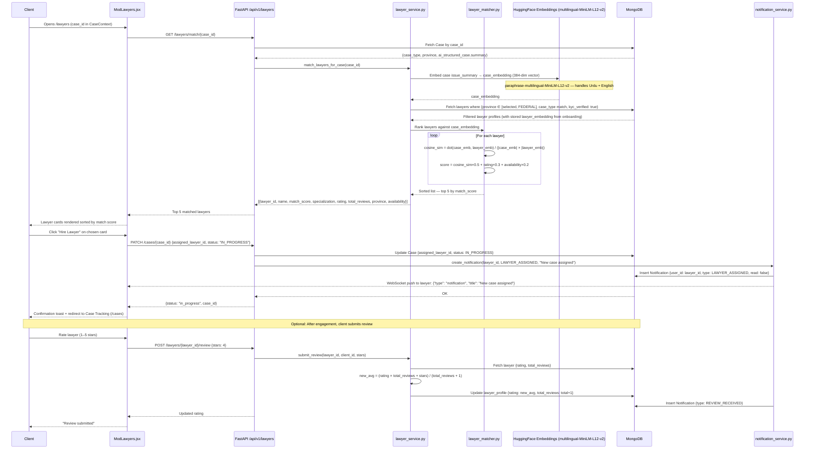
```mermaid
sequenceDiagram
    participant U as Client
    participant FE as ModLawyers.jsx
    participant API as FastAPI /api/v1/lawyers
    participant SVC as lawyer_service.py
    participant MTH as lawyer_matcher.py
    participant EMB as HuggingFace Embeddings (multilingual-MiniLM-L12-v2)
    participant DB as MongoDB
    participant NS as notification_service.py

    U->>FE: Opens /lawyers (case_id in CaseContext)
    FE->>API: GET /lawyers/match/{case_id}

    API->>DB: Fetch Case by case_id
    DB-->>API: {case_type, province, ai_structured_case.summary}

    API->>SVC: match_lawyers_for_case(case_id)
    SVC->>EMB: Embed case issue_summary → case_embedding (384-dim vector)
    Note over EMB: paraphrase-multilingual-MiniLM-L12-v2 — handles Urdu + English
    EMB-->>SVC: case_embedding

    SVC->>DB: Fetch lawyers where {province ∈ [selected, FEDERAL], case_type match, kyc_verified: true}
    DB-->>SVC: Filtered lawyer profiles (with stored lawyer_embedding from onboarding)

    SVC->>MTH: Rank lawyers against case_embedding
    loop For each lawyer
        MTH->>MTH: cosine_sim = dot(case_emb, lawyer_emb) / (|case_emb| × |lawyer_emb|)
        MTH->>MTH: score = cosine_sim×0.5 + rating×0.3 + availability×0.2
    end
    MTH-->>SVC: Sorted list — top 5 by match_score

    SVC-->>API: [{lawyer_id, name, match_score, specialization, rating, total_reviews, province, availability}]
    API-->>FE: Top 5 matched lawyers
    FE-->>U: Lawyer cards rendered sorted by match score

    U->>FE: Click "Hire Lawyer" on chosen card
    FE->>API: PATCH /cases/{case_id} {assigned_lawyer_id, status: "IN_PROGRESS"}
    API->>DB: Update Case {assigned_lawyer_id, status: IN_PROGRESS}
    API->>NS: create_notification(lawyer_id, LAWYER_ASSIGNED, "New case assigned")
    NS->>DB: Insert Notification {user_id: lawyer_id, type: LAWYER_ASSIGNED, read: false}
    NS-->>FE: WebSocket push to lawyer: {"type": "notification", "title": "New case assigned"}
    DB-->>API: OK
    API-->>FE: {status: "in_progress", case_id}
    FE-->>U: Confirmation toast + redirect to Case Tracking (/cases)

    Note over U,DB: Optional: After engagement, client submits review
    U->>FE: Rate lawyer (1–5 stars)
    FE->>API: POST /lawyers/{lawyer_id}/review {stars: 4}
    API->>SVC: submit_review(lawyer_id, client_id, stars)
    SVC->>DB: Fetch lawyer {rating, total_reviews}
    SVC->>SVC: new_avg = (rating × total_reviews + stars) / (total_reviews + 1)
    SVC->>DB: Update lawyer_profile {rating: new_avg, total_reviews: total+1}
    NS->>DB: Insert Notification {type: REVIEW_RECEIVED}
    API-->>FE: Updated rating
    FE-->>U: "Review submitted"
```

---

## SD-5: Digital Agreement Creation & E-Signature

**Non-trivial because:** Two-party signing flow, 3 signature methods with different ETO 2002 classifications, audit log, auto-transition to EXECUTED when both parties sign.

**Real agreement states** (`services/agreement_service.py`):
- Created as `PENDING` → client signs → lawyer signs → auto-transitions to `EXECUTED`
- Guards: prevents double-signing, rejects signing on EXECUTED agreement

**ETO 2002 classification** (from service code):
- `CANVAS` → "Advanced Electronic Signature (ETO 2002 S.2(d)(i))"
- `TYPED` / `IMAGE_UPLOAD` → "Basic Electronic Signature (ETO 2002)"

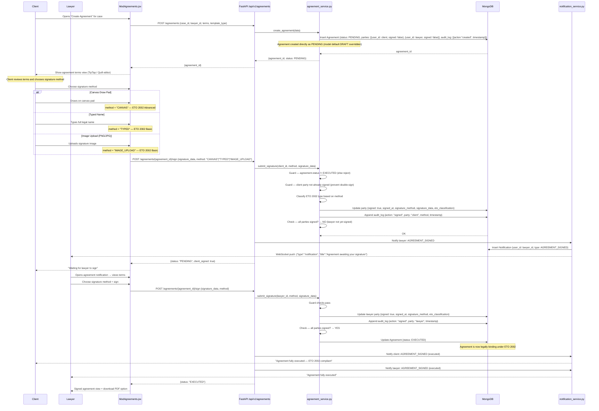
```mermaid
sequenceDiagram
    participant C as Client
    participant L as Lawyer
    participant FE as ModAgreements.jsx
    participant API as FastAPI /api/v1/agreements
    participant SVC as agreement_service.py
    participant DB as MongoDB
    participant NS as notification_service.py

    C->>FE: Opens "Create Agreement" for case
    FE->>API: POST /agreements {case_id, lawyer_id, terms, template_type}
    API->>SVC: create_agreement(data)
    SVC->>DB: Insert Agreement {status: PENDING, parties: [{user_id: client, signed: false}, {user_id: lawyer, signed: false}], audit_log: [{action:"created", timestamp}]}
    Note over SVC: Agreement created directly as PENDING (model default DRAFT overridden)
    DB-->>SVC: agreement_id
    SVC-->>API: {agreement_id, status: PENDING}
    API-->>FE: {agreement_id}
    FE-->>C: Show agreement terms view (TipTap / Quill editor)

    Note over C: Client reviews terms and chooses signature method

    C->>FE: Choose signature method
    alt Canvas Draw Pad
        C->>FE: Draws on canvas pad
        Note over FE: method = "CANVAS" — ETO 2002 Advanced
    else Typed Name
        C->>FE: Types full legal name
        Note over FE: method = "TYPED" — ETO 2002 Basic
    else Image Upload (PNG/JPG)
        C->>FE: Uploads signature image
        Note over FE: method = "IMAGE_UPLOAD" — ETO 2002 Basic
    end

    FE->>API: POST /agreements/{agreement_id}/sign {signature_data, method: "CANVAS"|"TYPED"|"IMAGE_UPLOAD"}
    API->>SVC: submit_signature(client_id, method, signature_data)
    SVC->>SVC: Guard — agreement.status != EXECUTED (else reject)
    SVC->>SVC: Guard — client party not already signed (prevent double-sign)
    SVC->>SVC: Classify ETO 2002 type based on method
    SVC->>DB: Update party {signed: true, signed_at, signature_method, signature_data, eto_classification}
    SVC->>DB: Append audit_log {action: "signed", party: "client", method, timestamp}
    SVC->>SVC: Check — all parties signed? → NO (lawyer not yet signed)
    DB-->>SVC: OK
    API->>NS: Notify lawyer: AGREEMENT_SIGNED
    NS->>DB: Insert Notification {user_id: lawyer_id, type: AGREEMENT_SIGNED}
    NS-->>L: WebSocket push: {"type":"notification", "title":"Agreement awaiting your signature"}
    API-->>FE: {status: "PENDING", client_signed: true}
    FE-->>C: "Waiting for lawyer to sign"

    L->>FE: Opens agreement notification → views terms
    L->>FE: Choose signature method + sign
    FE->>API: POST /agreements/{agreement_id}/sign {signature_data, method}
    API->>SVC: submit_signature(lawyer_id, method, signature_data)
    SVC->>SVC: Guard checks pass
    SVC->>DB: Update lawyer party {signed: true, signed_at, signature_method, eto_classification}
    SVC->>DB: Append audit_log {action: "signed", party: "lawyer", timestamp}
    SVC->>SVC: Check — all parties signed? → YES
    SVC->>DB: Update Agreement {status: EXECUTED}
    Note over DB: Agreement is now legally binding under ETO 2002

    API->>NS: Notify client: AGREEMENT_SIGNED (executed)
    NS-->>C: "Agreement fully executed — ETO 2002 compliant"
    API->>NS: Notify lawyer: AGREEMENT_SIGNED (executed)
    NS-->>L: "Agreement fully executed"
    API-->>FE: {status: "EXECUTED"}
    FE-->>L: Signed agreement view + download PDF option
```

---

## SD-6: Admin KYC Verification

**Non-trivial because:** Admin manually cross-checks against external bar council portals, then flips `kyc_verified` flag that gates all lawyer features. Triggers `KYC_APPROVED` or `KYC_REJECTED` notifications.

**Real endpoint** (`routes/admin.py`):
- `GET /admin/kyc/pending` → list of lawyers where `kyc_verified = false`
- `PATCH /admin/kyc/{lawyer_id}` → `{approved: bool, rejection_reason?: str}`

**Real KYC model** (`services/admin_service.py`):
- Approved: sets `kyc_verified = True`, clears `kyc_rejection_reason`
- Rejected: sets `kyc_rejection_reason`, kyc_verified stays False

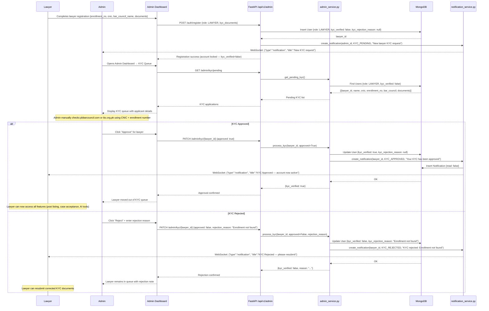
```mermaid
sequenceDiagram
    participant L as Lawyer
    participant A as Admin
    participant FE as Admin Dashboard
    participant API as FastAPI /api/v1/admin
    participant SVC as admin_service.py
    participant DB as MongoDB
    participant NS as notification_service.py

    L->>FE: Completes lawyer registration {enrollment_no, cnic, bar_council_name, documents}
    FE->>API: POST /auth/register {role: LAWYER, kyc_documents}
    API->>DB: Insert User {role: LAWYER, kyc_verified: false, kyc_rejection_reason: null}
    DB-->>API: lawyer_id
    API->>NS: create_notification(admin_id, KYC_PENDING, "New lawyer KYC request")
    NS-->>A: WebSocket: {"type":"notification", "title":"New KYC request"}
    API-->>FE: Registration success (account locked — kyc_verified=false)

    A->>FE: Opens Admin Dashboard → KYC Queue
    FE->>API: GET /admin/kyc/pending
    API->>SVC: get_pending_kyc()
    SVC->>DB: Find Users {role: LAWYER, kyc_verified: false}
    DB-->>SVC: [{lawyer_id, name, cnic, enrollment_no, bar_council, documents}]
    SVC-->>API: Pending KYC list
    API-->>FE: KYC applications
    FE-->>A: Display KYC queue with applicant details

    Note over A: Admin manually checks pbbarcouncil.com or ibc.org.pk using CNIC + enrollment number

    alt KYC Approved
        A->>FE: Click "Approve" for lawyer
        FE->>API: PATCH /admin/kyc/{lawyer_id} {approved: true}
        API->>SVC: process_kyc(lawyer_id, approved=True)
        SVC->>DB: Update User {kyc_verified: true, kyc_rejection_reason: null}
        SVC->>NS: create_notification(lawyer_id, KYC_APPROVED, "Your KYC has been approved")
        NS->>DB: Insert Notification {read: false}
        NS-->>L: WebSocket: {"type":"notification", "title":"KYC Approved — account now active"}
        DB-->>SVC: OK
        SVC-->>API: {kyc_verified: true}
        API-->>FE: Approval confirmed
        FE-->>A: Lawyer moved out of KYC queue
        Note over L: Lawyer can now access all features (post listing, case acceptance, AI tools)
    else KYC Rejected
        A->>FE: Click "Reject" + enter rejection reason
        FE->>API: PATCH /admin/kyc/{lawyer_id} {approved: false, rejection_reason: "Enrollment not found"}
        API->>SVC: process_kyc(lawyer_id, approved=False, rejection_reason)
        SVC->>DB: Update User {kyc_verified: false, kyc_rejection_reason: "Enrollment not found"}
        SVC->>NS: create_notification(lawyer_id, KYC_REJECTED, "KYC rejected: Enrollment not found")
        NS-->>L: WebSocket: {"type":"notification", "title":"KYC Rejected — please resubmit"}
        DB-->>SVC: OK
        SVC-->>API: {kyc_verified: false, reason: "..."}
        API-->>FE: Rejection confirmed
        FE-->>A: Lawyer remains in queue with rejection note
        Note over L: Lawyer can resubmit corrected KYC documents
    end
```

---

## SD-7: Lifecycle Transition Sequences (ST-1 to ST-4)

These compact sequences mirror the requested transition paths and the backend triggers from intake, agreements, KYC, and chat flows.

### ST-1 Sequence: Case Lifecycle Trigger Path

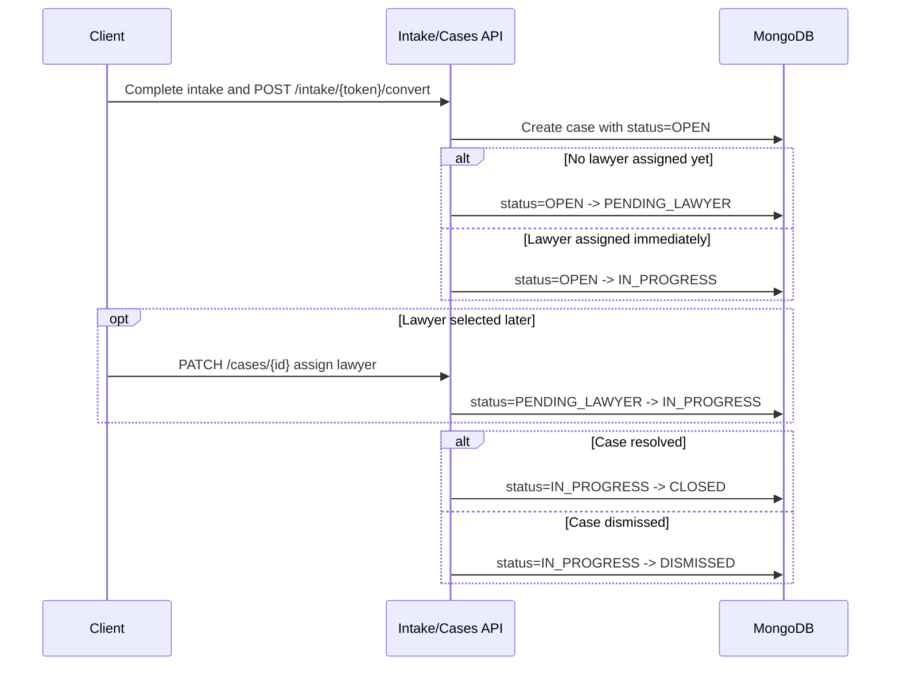
```mermaid
sequenceDiagram
    participant C as Client
    participant API as Intake/Cases API
    participant DB as MongoDB

    C->>API: Complete intake and POST /intake/{token}/convert
    API->>DB: Create case with status=OPEN

    alt No lawyer assigned yet
        API->>DB: status=OPEN -> PENDING_LAWYER
    else Lawyer assigned immediately
        API->>DB: status=OPEN -> IN_PROGRESS
    end

    opt Lawyer selected later
        C->>API: PATCH /cases/{id} assign lawyer
        API->>DB: status=PENDING_LAWYER -> IN_PROGRESS
    end

    alt Case resolved
        API->>DB: status=IN_PROGRESS -> CLOSED
    else Case dismissed
        API->>DB: status=IN_PROGRESS -> DISMISSED
    end
```

### ST-2 Sequence: Agreement Lifecycle Trigger Path

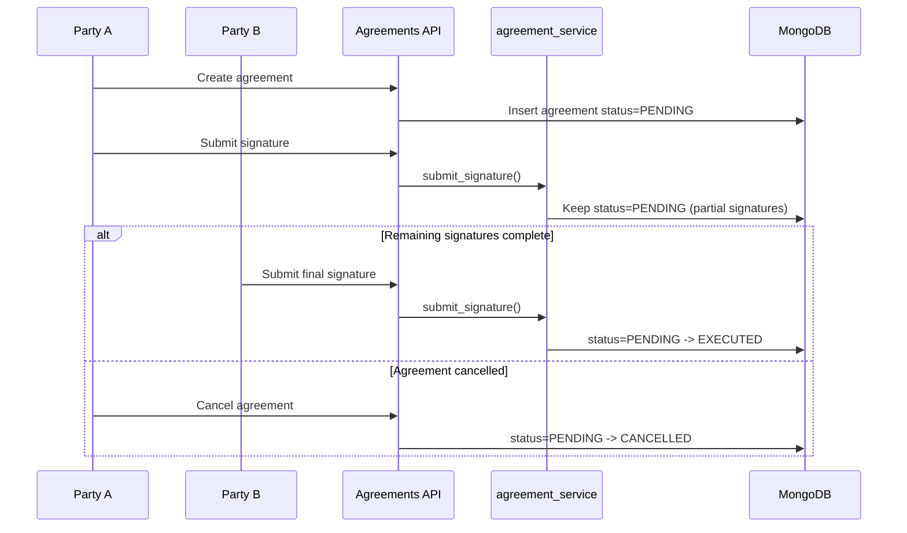
```mermaid
sequenceDiagram
    participant U1 as Party A
    participant U2 as Party B
    participant API as Agreements API
    participant SVC as agreement_service
    participant DB as MongoDB

    U1->>API: Create agreement
    API->>DB: Insert agreement status=PENDING

    U1->>API: Submit signature
    API->>SVC: submit_signature()
    SVC->>DB: Keep status=PENDING (partial signatures)

    alt Remaining signatures complete
        U2->>API: Submit final signature
        API->>SVC: submit_signature()
        SVC->>DB: status=PENDING -> EXECUTED
    else Agreement cancelled
        U1->>API: Cancel agreement
        API->>DB: status=PENDING -> CANCELLED
    end
```

### ST-3 Sequence: Lawyer KYC Trigger Path

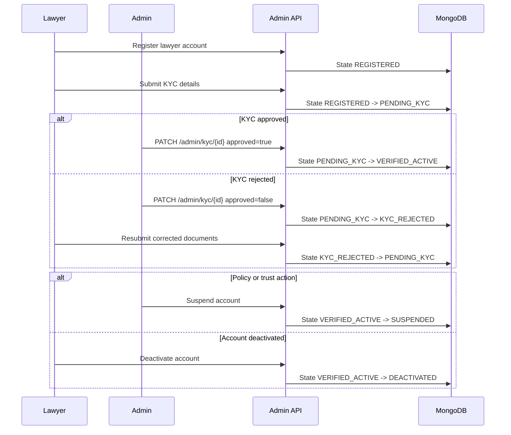
```mermaid
sequenceDiagram
    participant L as Lawyer
    participant A as Admin
    participant API as Admin API
    participant DB as MongoDB

    L->>API: Register lawyer account
    API->>DB: State REGISTERED

    L->>API: Submit KYC details
    API->>DB: State REGISTERED -> PENDING_KYC

    alt KYC approved
        A->>API: PATCH /admin/kyc/{id} approved=true
        API->>DB: State PENDING_KYC -> VERIFIED_ACTIVE
    else KYC rejected
        A->>API: PATCH /admin/kyc/{id} approved=false
        API->>DB: State PENDING_KYC -> KYC_REJECTED
        L->>API: Resubmit corrected documents
        API->>DB: State KYC_REJECTED -> PENDING_KYC
    end

    alt Policy or trust action
        A->>API: Suspend account
        API->>DB: State VERIFIED_ACTIVE -> SUSPENDED
    else Account deactivated
        L->>API: Deactivate account
        API->>DB: State VERIFIED_ACTIVE -> DEACTIVATED
    end
```

### ST-4 Sequence: AI Chat Session Trigger Path

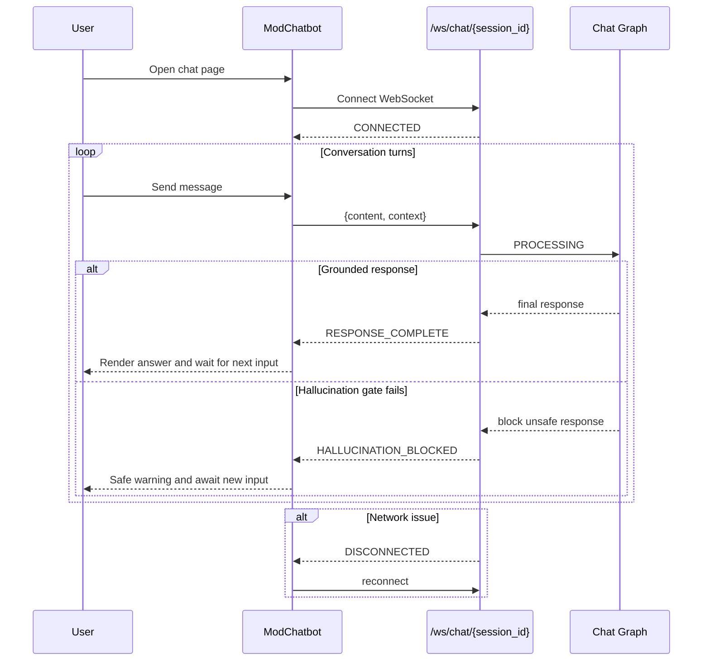
```mermaid
sequenceDiagram
    participant U as User
    participant FE as ModChatbot
    participant WS as /ws/chat/{session_id}
    participant G as Chat Graph

    U->>FE: Open chat page
    FE->>WS: Connect WebSocket
    WS-->>FE: CONNECTED

    loop Conversation turns
        U->>FE: Send message
        FE->>WS: {content, context}
        WS->>G: PROCESSING

        alt Grounded response
            G-->>WS: final response
            WS-->>FE: RESPONSE_COMPLETE
            FE-->>U: Render answer and wait for next input
        else Hallucination gate fails
            G-->>WS: block unsafe response
            WS-->>FE: HALLUCINATION_BLOCKED
            FE-->>U: Safe warning and await new input
        end
    end

    alt Network issue
        WS-->>FE: DISCONNECTED
        FE->>WS: reconnect
    end
```

---

# STATE TRANSITION DIAGRAMS

> All states, transitions, and triggers are sourced directly from backend constants, models, and services.

---

## STD-1: Case Lifecycle (Requested ST-1)

**Entity:** `Case` document in MongoDB
**State field:** `case.status` (enum `CaseStatus` in `core/constants.py`)

**Target transition:** `INTAKE -> OPEN -> (PENDING_LAWYER or IN_PROGRESS) -> (CLOSED or DISMISSED)`
**Backed by:** `intake_service.py`, `case_service.py`, `core/constants.py`

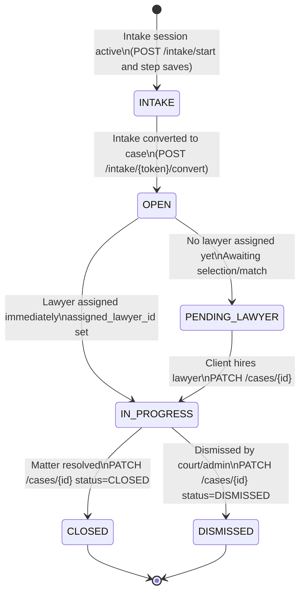
```mermaid
stateDiagram-v2
    [*] --> INTAKE : Intake session active\n(POST /intake/start and step saves)

    INTAKE --> OPEN : Intake converted to case\n(POST /intake/{token}/convert)

    OPEN --> PENDING_LAWYER : No lawyer assigned yet\nAwaiting selection/match
    OPEN --> IN_PROGRESS : Lawyer assigned immediately\nassigned_lawyer_id set

    PENDING_LAWYER --> IN_PROGRESS : Client hires lawyer\nPATCH /cases/{id}

    IN_PROGRESS --> CLOSED : Matter resolved\nPATCH /cases/{id} status=CLOSED
    IN_PROGRESS --> DISMISSED : Dismissed by court/admin\nPATCH /cases/{id} status=DISMISSED

    CLOSED --> [*]
    DISMISSED --> [*]
```

---

## STD-2: Intake Step Progression

**Entity:** `Intake` document in MongoDB + `CaseContext` frontend state
**State fields:** `intake.current_step` (1–5), `intake.completed` (bool), `intakeDone` (CaseContext)

**Frontend steps** (from `ModIntake.jsx`):
Step 1 = Role Selection, Step 2 = Case Input, Step 3 = AI Questions, Step 4 = Case Summary, Step 5 = Categorization

**Backend steps** (from `intake_service.py` `STEP_REQUIRED_FIELDS`):
Step 1 requires `province`, Step 2 requires `case_type + urgency`, Step 3 requires `incident_description`, Step 4 = optional fields, Step 5 requires `desired_outcome`

```mermaid
stateDiagram-v2
    [*] --> NOT_STARTED : User not yet on intake page

    NOT_STARTED --> STEP_1_ROLE : POST /intake/start\nintake.current_step = 1\nintake.completed = false

    STEP_1_ROLE --> STEP_1_ROLE : Validation fails\n(province missing)

    STEP_1_ROLE --> STEP_2_CASE_INPUT : PATCH /intake/token/step/1 success\nRole (Plaintiff|Defendant) + Province saved

    STEP_2_CASE_INPUT --> STEP_2_CASE_INPUT : Input toggle\ntext ↔ voice\n(is_recording state)

    STEP_2_CASE_INPUT --> STEP_2_CASE_INPUT : Validation fails\n(case_type or urgency missing)

    STEP_2_CASE_INPUT --> STEP_3_AI_QUESTIONS : PATCH /intake/token/step/2 success\ncase_type + urgency saved
    Note on STEP_3_AI_QUESTIONS: 6 AI follow-up questions shown\n2–3 required, rest optional\nStatus badge: Required | Optional | Done

    STEP_3_AI_QUESTIONS --> STEP_3_AI_QUESTIONS : Validation fails\n(incident_description missing)

    STEP_3_AI_QUESTIONS --> STEP_4_AI_SUMMARY : PATCH /intake/token/step/3 success\nIncident details saved
    Note on STEP_4_AI_SUMMARY: AI generates case summary\nwith confidence score (e.g. 87%)\nClient can edit the summary

    STEP_4_AI_SUMMARY --> STEP_5_CATEGORIZE : PATCH /intake/token/step/4 success\nEvidence info saved (optional fields)

    STEP_5_CATEGORIZE --> STEP_5_CATEGORIZE : Validation fails\n(desired_outcome missing)

    STEP_5_CATEGORIZE --> CONVERTING : PATCH /intake/token/step/5 success\nAll 5 steps complete\nProgress = 100%

    CONVERTING --> COMPLETED : POST /intake/token/convert success\nintake.completed = true\nCase created (status: OPEN)\nCaseContext.intakeDone = true

    CONVERTING --> STEP_5_CATEGORIZE : convert fails\n(validation error)

    COMPLETED --> [*] : User redirected to /chat\nwith case context loaded

    NOT_STARTED --> NOT_STARTED : Locked steps show padlock icon\nBlocked nav shows toast warning
```

---

## STD-3: Agreement Lifecycle (Requested ST-2)

**Entity:** `Agreement` document in MongoDB
**State field:** `agreement.status` (enum `AgreementStatus` in `models/agreement.py`)

**Target transition:** `PENDING -> EXECUTED or CANCELLED`
**Backed by:** `models/agreement.py`, `services/agreement_service.py`

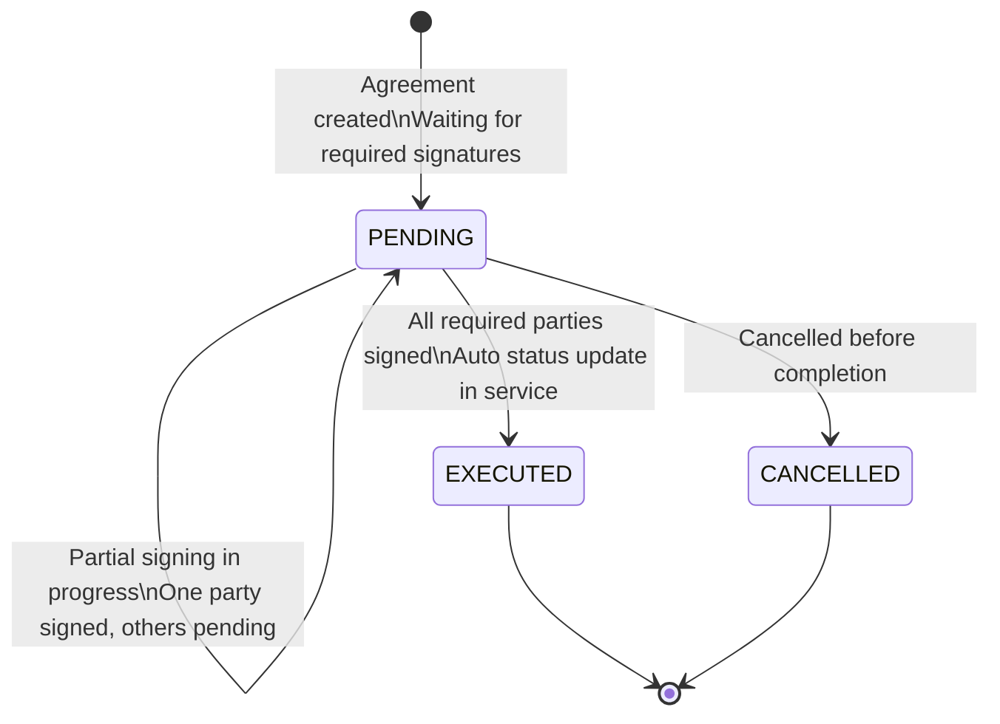
```mermaid
stateDiagram-v2
    [*] --> PENDING : Agreement created\nWaiting for required signatures

    PENDING --> PENDING : Partial signing in progress\nOne party signed, others pending
    PENDING --> EXECUTED : All required parties signed\nAuto status update in service
    PENDING --> CANCELLED : Cancelled before completion

    EXECUTED --> [*]
    CANCELLED --> [*]
```

---

## STD-4: Document Generation Lifecycle

**Entity:** `Document` document in MongoDB
**State field:** `document.status` (string: `"pending"` | `"generated"` | `"failed"`)

**Real flow from `document_service.py`:**
1. `generate_document()` inserts with `status="pending"`
2. `_fill_template()` runs → success → `status="generated"`, `file_path` set
3. Exception during generation → `status="failed"`, error appended

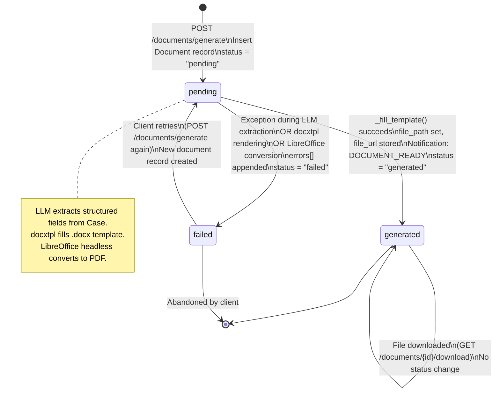
```mermaid
stateDiagram-v2
    [*] --> pending : POST /documents/generate\nInsert Document record\nstatus = "pending"

    note right of pending
        LLM extracts structured fields from Case.
        docxtpl fills .docx template.
        LibreOffice headless converts to PDF.
    end note

    pending --> generated : _fill_template() succeeds\nfile_path set, file_url stored\nNotification: DOCUMENT_READY\nstatus = "generated"

    pending --> failed : Exception during LLM extraction\nOR docxtpl rendering\nOR LibreOffice conversion\nerrors[] appended\nstatus = "failed"

    generated --> generated : File downloaded\n(GET /documents/{id}/download)\nNo status change

    failed --> pending : Client retries\n(POST /documents/generate again)\nNew document record created

    generated --> [*]
    failed --> [*] : Abandoned by client
```

---

## STD-5: Lawyer Account (KYC) Lifecycle (Requested ST-3)

**Entity:** `User` document (role = LAWYER) + `LawyerProfile` in MongoDB
**State fields:** `user.kyc_verified` (bool), `lawyer_profile.kyc_rejection_reason` (str | null)

**Target transition:** `REGISTERED -> PENDING_KYC -> VERIFIED_ACTIVE or KYC_REJECTED (loop) -> SUSPENDED or DEACTIVATED`
**Backed by:** `models/user.py`, `services/admin_service.py`, `BACKEND_PROGRESS.md`

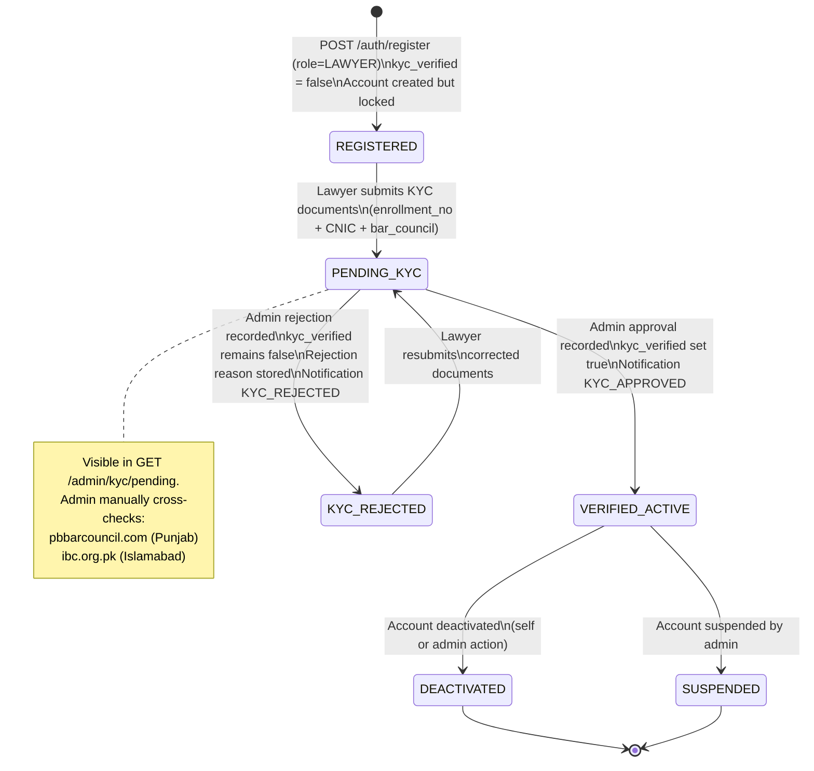
```mermaid
stateDiagram-v2
    [*] --> REGISTERED : POST /auth/register (role=LAWYER)\nkyc_verified = false\nAccount created but locked

    REGISTERED --> PENDING_KYC : Lawyer submits KYC documents\n(enrollment_no + CNIC + bar_council)

    note right of PENDING_KYC
        Visible in GET /admin/kyc/pending.
        Admin manually cross-checks:
        pbbarcouncil.com (Punjab)
        ibc.org.pk (Islamabad)
    end note

    PENDING_KYC --> VERIFIED_ACTIVE : Admin approval recorded\nkyc_verified set true\nNotification KYC_APPROVED

    PENDING_KYC --> KYC_REJECTED : Admin rejection recorded\nkyc_verified remains false\nRejection reason stored\nNotification KYC_REJECTED

    KYC_REJECTED --> PENDING_KYC : Lawyer resubmits\ncorrected documents

    VERIFIED_ACTIVE --> SUSPENDED : Account suspended by admin
    VERIFIED_ACTIVE --> DEACTIVATED : Account deactivated\n(self or admin action)

    DEACTIVATED --> [*]
    SUSPENDED --> [*]
```

---

## STD-6: AI Chat Session Lifecycle (Requested ST-4)

**Entity:** WebSocket session at `/ws/chat/{session_id}`
**State tracked in:** `chat_socket.py` (server-side) + `ModChatbot.jsx` (client-side)

**Real WebSocket message types from `chat_socket.py`:**
- Client → Server: `{content, case_id?, case_type?, province?}`
- Server → Client: `{type: "token"}`, `{type: "final", citations, confidence}`, `{type: "clarification", question}`

**Target transition:** `PAGE_LOADED -> CONNECTING -> CONNECTED -> AWAITING_INPUT -> PROCESSING -> RESPONSE_COMPLETE` with loop back and error states `DISCONNECTED`, `HALLUCINATION_BLOCKED`
**Backed by:** `websockets/chat_socket.py`, `ModChatbot.jsx`, `intake_lawyer_pipeline.md`

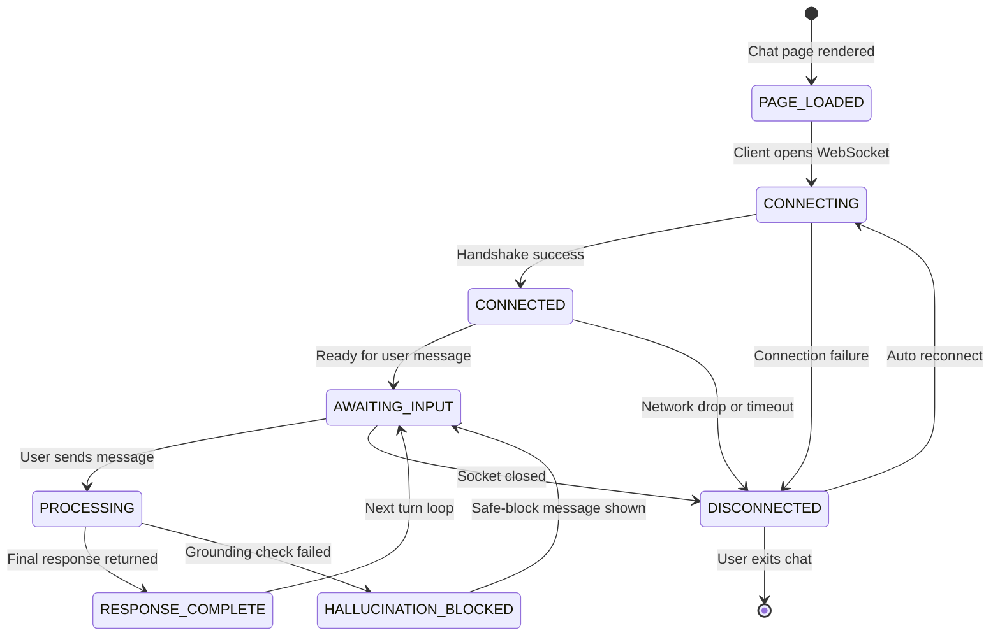
```mermaid
stateDiagram-v2
    [*] --> PAGE_LOADED : Chat page rendered
    PAGE_LOADED --> CONNECTING : Client opens WebSocket
    CONNECTING --> CONNECTED : Handshake success

    CONNECTED --> AWAITING_INPUT : Ready for user message
    AWAITING_INPUT --> PROCESSING : User sends message

    PROCESSING --> RESPONSE_COMPLETE : Final response returned
    RESPONSE_COMPLETE --> AWAITING_INPUT : Next turn loop

    PROCESSING --> HALLUCINATION_BLOCKED : Grounding check failed
    HALLUCINATION_BLOCKED --> AWAITING_INPUT : Safe-block message shown

    CONNECTING --> DISCONNECTED : Connection failure
    CONNECTED --> DISCONNECTED : Network drop or timeout
    AWAITING_INPUT --> DISCONNECTED : Socket closed
    DISCONNECTED --> CONNECTING : Auto reconnect

    DISCONNECTED --> [*] : User exits chat
```

---

## STD-7: User Authentication Lifecycle (inspired by screenshots)

**Entity:** Authentication flow (Sign-in / Registration / Email verification)

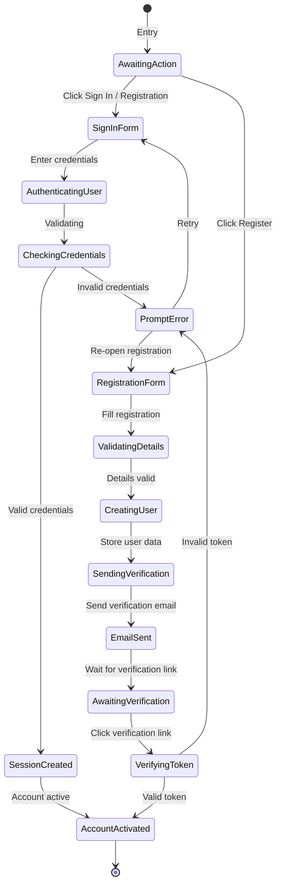
```mermaid
stateDiagram-v2
    [*] --> AwaitingAction : Entry

    AwaitingAction --> SignInForm : Click Sign In / Registration
    SignInForm --> AuthenticatingUser : Enter credentials
    AuthenticatingUser --> CheckingCredentials : Validating

    CheckingCredentials --> SessionCreated : Valid credentials
    SessionCreated --> AccountActivated : Account active
    AccountActivated --> [*]

    CheckingCredentials --> PromptError : Invalid credentials
    PromptError --> SignInForm : Retry

    %% Registration path
    AwaitingAction --> RegistrationForm : Click Register
    RegistrationForm --> ValidatingDetails : Fill registration
    ValidatingDetails --> CreatingUser : Details valid
    CreatingUser --> SendingVerification : Store user data
    SendingVerification --> EmailSent : Send verification email
    EmailSent --> AwaitingVerification : Wait for verification link
    AwaitingVerification --> VerifyingToken : Click verification link
    VerifyingToken --> AccountActivated : Valid token
    VerifyingToken --> PromptError : Invalid token

    %% Allow resubmit loop
    PromptError --> RegistrationForm : Re-open registration
```

---

## STD-8: Email Sync Connection Lifecycle (inspired by screenshots)

**Entity:** Email sync connection and active syncing

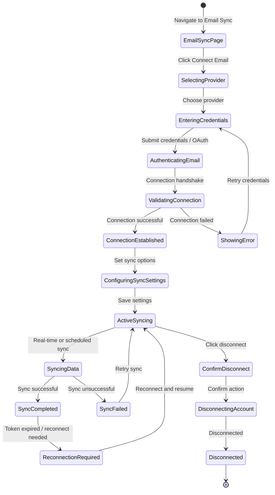
```mermaid
stateDiagram-v2
    [*] --> EmailSyncPage : Navigate to Email Sync

    EmailSyncPage --> SelectingProvider : Click Connect Email
    SelectingProvider --> EnteringCredentials : Choose provider
    EnteringCredentials --> AuthenticatingEmail : Submit credentials / OAuth
    AuthenticatingEmail --> ValidatingConnection : Connection handshake
    ValidatingConnection --> ConnectionEstablished : Connection successful
    ValidatingConnection --> ShowingError : Connection failed
    ShowingError --> EnteringCredentials : Retry credentials

    ConnectionEstablished --> ConfiguringSyncSettings : Set sync options
    ConfiguringSyncSettings --> ActiveSyncing : Save settings

    ActiveSyncing --> SyncingData : Real-time or scheduled sync
    SyncingData --> SyncCompleted : Sync successful
    SyncingData --> SyncFailed : Sync unsuccessful
    SyncFailed --> ActiveSyncing : Retry sync
    SyncCompleted --> ReconnectionRequired : Token expired / reconnect needed
    ReconnectionRequired --> ActiveSyncing : Reconnect and resume

    ActiveSyncing --> ConfirmDisconnect : Click disconnect
    ConfirmDisconnect --> DisconnectingAccount : Confirm action
    DisconnectingAccount --> Disconnected : Disconnected
    Disconnected --> [*]
```

---

## Notification State (Supplementary)

**Entity:** `Notification` document in MongoDB
**State field:** `notification.read` (bool), `notification.read_at` (datetime | null)

**Notification types from `constants.py`:** `CASE_UPDATE`, `LAWYER_ASSIGNED`, `HEARING_SCHEDULED`, `DOCUMENT_READY`, `AGREEMENT_SIGNED`, `KYC_APPROVED`, `KYC_REJECTED`, `REVIEW_RECEIVED`

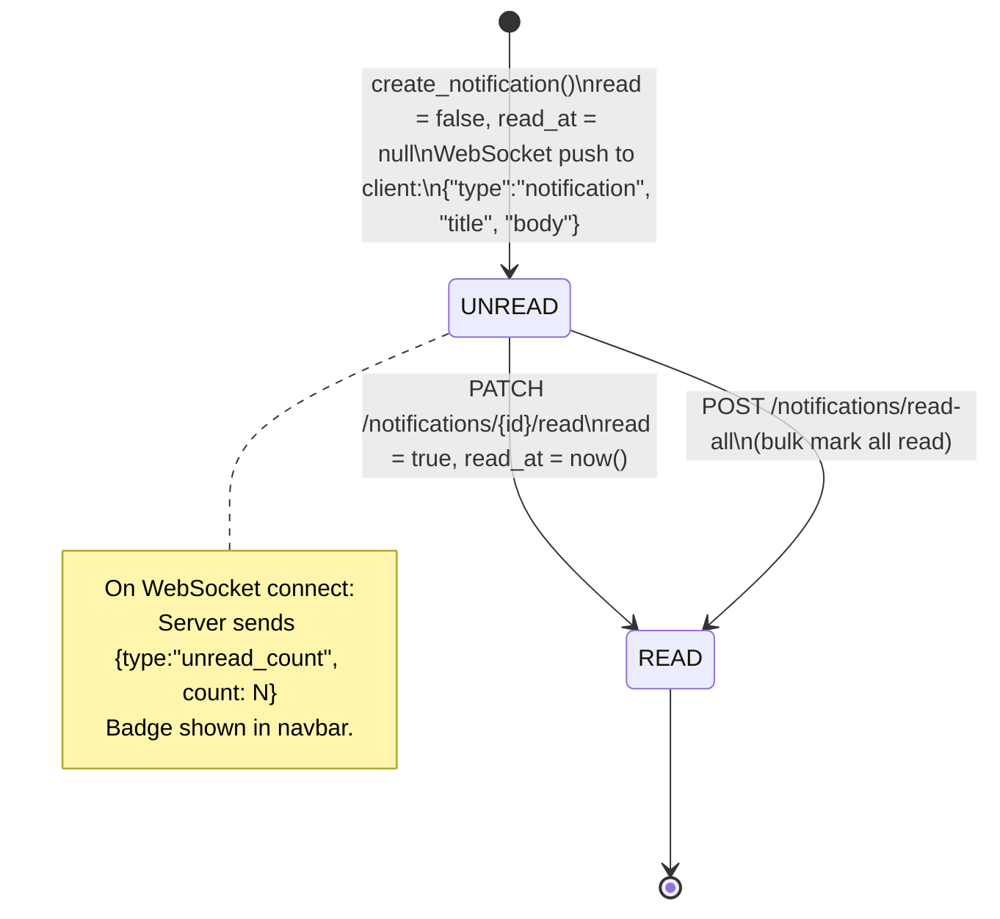
```mermaid
stateDiagram-v2
    [*] --> UNREAD : create_notification()\nread = false, read_at = null\nWebSocket push to client:\n{"type":"notification", "title", "body"}

    UNREAD --> READ : PATCH /notifications/{id}/read\nread = true, read_at = now()

    UNREAD --> READ : POST /notifications/read-all\n(bulk mark all read)

    note right of UNREAD
        On WebSocket connect:
        Server sends {type:"unread_count", count: N}
        Badge shown in navbar.
    end note

    READ --> [*]
```

---

## Diagrams by Module (Quick Map)

| Module | Sequence Diagram | State Transition Diagram |
|---|---|---|
| M2 Legal Intake | SD-2 | STD-2 |
| M3 AI Chatbot | SD-1 | STD-6 |
| M4 Lawyer Matching | SD-4 | — |
| M5 E-Signatures | SD-5 | STD-3 |
| M6 Document Generation | SD-3 | STD-4 |
| M7 Case Tracking | — | STD-1 |
| M8/M9 KYC & Admin | SD-6 | STD-5 |

> Render diagrams at **mermaid.live** → export PNG/SVG for your report.
> All state names, endpoint paths, field names, and notification types match the actual backend code.
