# 3.3 Architecture Style / Pattern

## Selected Pattern: Client-Server with Layered Backend Architecture

The Attorney.AI system fundamentally follows a **Client-Server** macro-architecture, combined with a strict **Layered Architecture** within the backend.

### Justification for this Style

1. **Separation of Concerns**: A decoupled Client-Server model allows the Next.js frontend to focus purely on User Experience (UX), application routing, and role-based views (Client, Lawyer, Admin), while the FastAPI backend independently handles computationally heavy AI orchestration and legal retrieval.
2. **Maintainability & Scalability**: The internal Layered Architecture of the backend prevents business logic from bleeding into API routing. This makes it straightforward to swap out the underlying database or change the LLM provider without rewriting any API endpoints.
3. **Security**: Keeping the AI pipeline and database access strictly on the server layer ensures that proprietary legal datasets, API keys, and prompt logic are never exposed to the client.

### Component Mapping Diagram

```mermaid
graph TD
    subgraph Client-Server Architecture
        subgraph Client [Presentation Layer - Next.js]
            UI[User Interfaces / Role Views]
            State[State Management / Hooks]
            ClientAPI[API Client & WebSockets]
        end

        subgraph Server [Layered Backend Architecture - FastAPI]
            API[API Layer / Route Endpoints]
            Service[Business Logic & Service Layer]
            AI[AI Orchestration Layer / LangGraph]
            Repo[Data Access / Repository Layer]
        end

        subgraph Databases [Database Layer]
            Mongo[(MongoDB - Relational/Document)]
            Chroma[(ChromaDB - Vector Store)]
        end
        
        subgraph External [External Services]
            LLM[LLM Providers - Gemini/Groq]
        end

        %% Client Internal
        UI --> State
        State --> ClientAPI
        
        %% Client to Server
        ClientAPI -- HTTP/WS Requests --> API
        
        %% Server Internal Layers
        API -- Validated Data --> Service
        Service -- Generative Tasks --> AI
        Service -- Data Needs --> Repo
        AI -- Context Retrieval --> Repo
        
        %% External Calls
        AI -- API Calls --> LLM
        
        %% Database Calls
        Repo -- CRUD Operations --> Mongo
        Repo -- Semantic Search --> Chroma
    end
    
    classDef client fill:#e0f2fe,stroke:#0284c7,stroke-width:2px;
    classDef server fill:#fef3c7,stroke:#d97706,stroke-width:2px;
    classDef db fill:#dcfce7,stroke:#16a34a,stroke-width:2px;
    classDef ext fill:#f3e8ff,stroke:#9333ea,stroke-width:2px;
    
    class Client client;
    class Server server;
    class Databases db;
    class External ext;
```

### Component Interactions

The backend is strictly decomposed into logical layers that map to this architectural style. Here is how they interact during a typical application flow:

1. **Presentation Layer (Frontend) ➔ API Layer**: 
   The frontend initiates an HTTP or WebSocket request (e.g., a client submitting a legal query). The API Layer (`app/api/v1/routes/`) receives this request, validates the incoming schema (using Pydantic), and verifies authorization via JWT tokens.
2. **API Layer ➔ Service / AI Layer**: 
   Once the request is validated, the API Layer delegates the processing to the Service Layer (`app/services/` & `app/ai/`). This layer contains the core application business logic. For AI-driven interactions, the LangGraph AI pipeline is invoked.
3. **Service / AI Layer ➔ External Services**: 
   For generative tasks requiring natural language processing, the AI Layer securely communicates with external LLM APIs (such as Gemini or Groq) to synthesize responses. This server-side communication ensures API keys and prompts remain hidden from the frontend.
4. **Service / AI Layer ➔ Repository Layer**: 
   When the Service or AI layer requires data (such as user profiles, session history, or vector embeddings for RAG), it calls the Repository Layer (`app/repositories/`). The Service Layer is strictly prohibited from executing database queries directly.
5. **Repository Layer ➔ Database Layer**: 
   The Repository layer serves as the exclusive interface to the databases. It uses Motor for asynchronous operations with MongoDB and the ChromaDB client for vector searches. Retrieved data is structured into domain models and passed back up through the layers to ultimately formulate the HTTP/WebSocket response to the Presentation layer.
